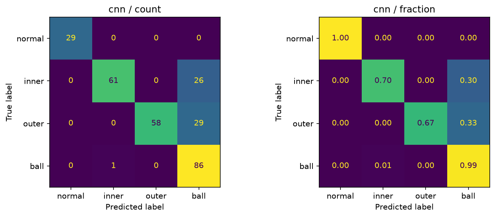
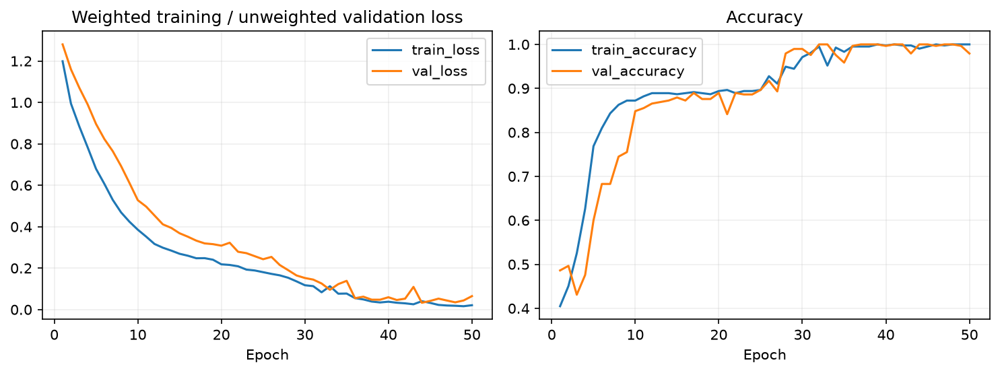
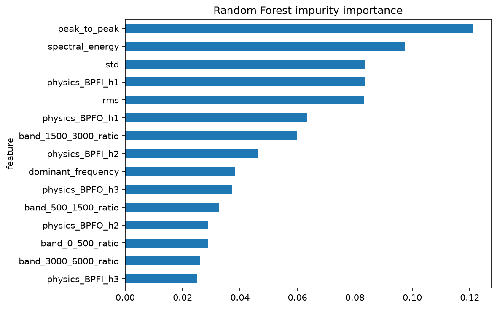
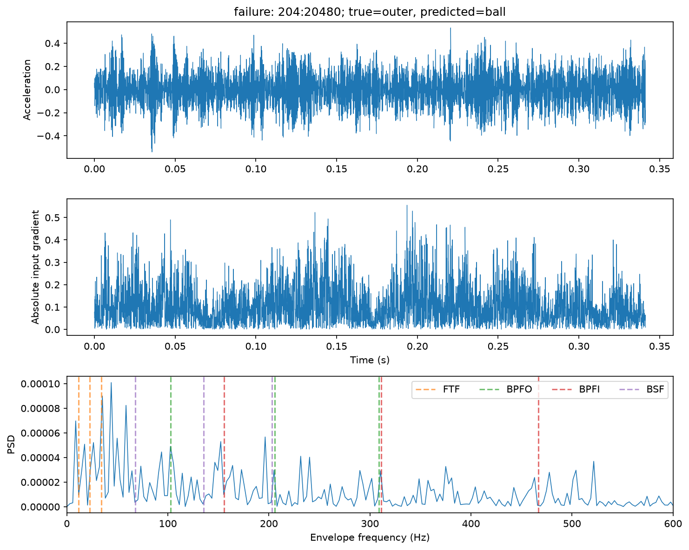
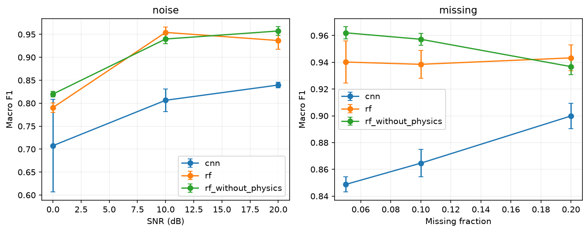
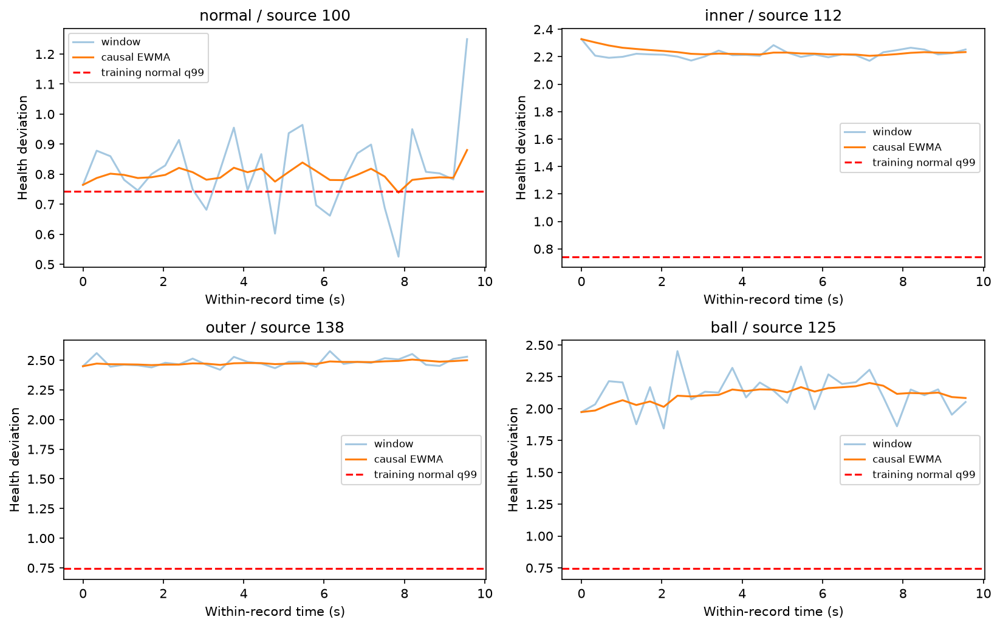

# Vibration-Based Bearing Fault Diagnosis and Health-Trend Analysis

[简体中文](README.md) | **English**

A Python project using actual CWRU vibration recordings, covering data acquisition, signal processing, four-class fault recognition, characteristic bearing frequencies, a health-deviation index, explanations, perturbation tests and an interactive Streamlit demo.

**Both quick and full configurations have completed actual CPU training and evaluation. Health trends describe within-record changes in deviation, not natural degradation or remaining useful life (RUL).**

## Start here

- **Review saved results:** [full experiment report](outputs/full-verified/reports/experiment.md), [per-seed metrics](outputs/full-verified/metrics/comparison.csv), and [historical independent verification](outputs/full-verified/reports/verification.json). Reading them requires no data download or training.
- **Find the implementation:** [data processing](src/bearing_diagnosis/data.py), [physical features](src/bearing_diagnosis/physics.py), [models](src/bearing_diagnosis/models.py), and [Demo](app/streamlit_app.py).
- **Check the source checkout:** install the dependencies below, then run `python -m pytest -q` and `python .github/scripts/check_readmes.py`. These check code and navigation; they do not replay the complete model experiment.
- **Reproduce the full pipeline:** the quick/full commands below download real data and train models. A normal clone excludes raw data, weights and caches. `verify_run.py` requires those complete local assets; the tracked CSVs/reports alone cannot satisfy every check. Do not point it at frozen outputs and overwrite the historical verification file.

```bash
git clone https://github.com/kimzclandi/bearing-fault-diagnosis.git
cd bearing-fault-diagnosis
```

The [collaborators](#collaborators) below are listed without an asserted individual module assignment or contribution percentage.

## Processing pipeline

```text
Official MAT files → checksums and provenance → whole-file/load split
                                              ↓
                      Anti-aliased downsampling → DC removal → fixed windows
                                              ↓
                        Statistical/spectral/physical features → Random Forest
                                                   Raw windows → 1D CNN
                                              ↓
           Classification → explanations → perturbations → health index → demo
```

## Dataset and downloads

- Dataset: Case Western Reserve University Bearing Data Center (CWRU).
- [Official overview](https://engineering.case.edu/bearingdatacenter/download-data-file), [48 kHz drive-end faults](https://engineering.case.edu/bearingdatacenter/48k-drive-end-bearing-fault-data), [normal baseline](https://engineering.case.edu/bearingdatacenter/normal-baseline-data), [bearing geometry](https://engineering.case.edu/bearingdatacenter/bearing-information).
- Selected 40 MAT files: four normal recordings; inner-race, outer-race and ball faults each span three defect diameters × four loads. Outer-race data uses the official table's `@6:00` position.
- Classes: `0 normal`, `1 inner`, `2 outer`, `3 ball`. Defect diameters 0.007, 0.014 and 0.021 inches remain provenance metadata and are not model inputs.
- Signal fields: prefer `X<file number>_DE_time`. A logged fallback is allowed only when exactly one candidate exists. RPM must match the selected channel prefix; missing RPM uses the official nominal value with provenance recorded.
- Loads 0/1/2/3 HP correspond to nominal 1797/1772/1750/1730 rpm; actual file RPM takes precedence.
- Fault files belong to the official 48 kHz collection. Normal files use an explicit 48 kHz configuration assumption: the official table lacks per-file sampling rates and MAT files lack complete independently verifiable rate metadata. **Sampling rate is not inferred from array length.**
- All signals use `resample_poly` anti-aliasing to downsample to 12 kHz.
- Raw data is not redistributed with code. The official pages permit public downloads, but no explicit data-license terms were found; public download access is not treated as unrestricted redistribution permission.

See [data documentation](data/README.md), [file manifest](data/manifests/cwru.csv) and [recorded checksums](data/manifests/checksums.json). Checksums were generated from actual downloads, not claimed as provider-issued signatures.

```bash
python scripts/download_data.py --config configs/quick.yaml --run-dir outputs/download-local
```

The downloader uses 1 MiB chunks, bounded retries, resume support, MAT decoding checks and atomic final renaming. Configure `data_dir` for existing files. Missing files are never replaced with synthetic data. Resume later if offline, or place the original files under their expected names in the configured directory.

Source anomalies remain explicit: `99.mat` also contains an `X098` channel and `175.mat` an `X217` channel; only the matching file channel is selected. `174.mat` contains only `X173` and a shorter recording; the anomaly and official row label are retained. See [execution notes](docs/execution_notes.md).

## Installation

Python 3.12 is recommended; CPU is sufficient. `cuda` can be configured, but GPU execution was not verified.

```bash
python -m venv .venv
source .venv/bin/activate
python -m pip install -r requirements.txt
python -m pip install --no-deps -e .
python -m pytest -q
```

`requirements-lock.txt` records the exact versions used; substitute it for `requirements.txt` to reuse those versions. Platforms may require different PyTorch wheels. Equal versions do not guarantee bitwise equality across hardware.

## Quick verification

```bash
python scripts/run_all.py --config configs/quick.yaml --run-dir outputs/quick-local --download
python scripts/verify_run.py --run-dir outputs/quick-local
python scripts/check_reproducibility.py --run-dir outputs/quick-local
```

The full command first runs automated tests, then processing, both model families, evaluation, explanation, health-index analysis, robustness and reporting. Use a new run directory each time; existing directories are rejected to preserve previous results.

## Full experiment

```bash
python scripts/run_all.py --config configs/full.yaml --run-dir outputs/full-local --download
python scripts/verify_run.py --run-dir outputs/full-local
python scripts/check_reproducibility.py --run-dir outputs/full-local
```

| Parameter | Quick | Full |
|---|---|---|
| Files/split | Same 40 files | Same 40 files |
| Window length/overlap | 4096 / 0% | 4096 / 0% |
| Windows per file | Up to 24, uniformly selected indices | All valid windows |
| Maximum CNN epochs | 8 | 50 |
| Early-stopping patience | 3 | 8 |
| RF trees | 100 | 300 |
| Training seeds | 42 | 42, 43, 44 |

“Full” covers the prespecified subset, not all CWRU recordings. Both configurations were fixed before the first model evaluation.

## Processing and leakage protection

| Split | Load | Files | Full windows |
|---|---|---:|---:|
| train | 0, 1 HP | 20 | 415 |
| val | 2 HP | 10 | 290 |
| test | 3 HP | 10 | 290 |

Quick has 370/240/240 train/validation/test windows; full has 995 windows in total.

1. **Split files before windowing.** All windows from one recording belong to one split; windows do not overlap by default.
2. Check file SHA-256 and selected-signal hashes; reject duplicates. Save selected/ignored channels, original length, RPM source and window positions.
3. Remove DC per window. CNN global mean/standard deviation and feature normalization are fitted on training only and saved with models. No per-window amplitude normalization.
4. NaN/Inf, constant or too-short signals, and invalid rates raise errors. Extreme peaks produce quality warnings; impulses are not clipped by default.
5. No default bandpass for raw classification input. Optional `filter_band` must lie strictly below Nyquist. Envelope features use a fixed candidate 2–5 kHz resonance band, not a claimed optimal band.
6. Validation selects best weights and early stopping; test does not select parameters. Models share the same test-window manifest. Perturbations use fixed independent seeds.
7. File names, defect sizes, loads and encoded labels are not prediction features. Speed is used only for explicit physical-frequency calculations.

**Remaining scope:** files at different loads may come from the same bearing, and recordings have acquisition differences. Results support held-out operating-condition evaluation, not independent-device generalization. Dependent windows cannot be counted as 995 independent machines.

## Features and models

The 17 base features are mean, standard deviation, RMS, peak-to-peak amplitude, skewness, Pearson kurtosis, crest factor, shape factor, impulse factor, clearance factor, spectral energy, dominant frequency, spectral centroid, and energy ratios for 0–500, 500–1500, 1500–3000 and 3000–6000 Hz. Denominators have numerical guards; pre-DC mean is stored separately as metadata. PSD uses explicit density normalization with a Parseval consistency test.

- **Random Forest:** base features plus 12 physical features, balanced class weights and minimum leaf size 2.
- **Physical ablation:** same data, seeds and tree parameters; remove only the 12 physical features.
- **1D CNN:** input `[batch, 1, 4096]`; three strided convolution layers, BatchNorm, ReLU, global pooling, Dropout and a four-class head.
- **Training:** Adam, learning rate 0.001, class-weighted cross-entropy. Select weights by validation Macro F1, breaking ties with validation loss. Training loss is weighted and validation loss unweighted; plots label this distinction.
- **Determinism:** fixed seeds and deterministic PyTorch algorithms. RF training can be parallel; prediction aggregation uses one thread to avoid summation-order differences for near-ties.

## Bearing physics

Let shaft frequency `fr = RPM / 60`, rolling-element count `n`, rolling-element diameter `d`, pitch diameter `D`, and contact angle `theta`:

```text
FTF  = fr/2 × (1 − d/D × cos(theta))
BPFO = n×fr/2 × (1 − d/D × cos(theta))
BPFI = n×fr/2 × (1 + d/D × cos(theta))
BSF  = D×fr/(2×d) × [1 − (d/D × cos(theta))²]
```

Diameters must share units. Configuration uses official `d=0.3126`, `D=1.537` inches. `n=9` and zero contact angle are idealized settings consistent with official race-fault frequency multipliers. Standard BSF is about 2.3567 times shaft frequency; the official ball multiplier 4.7135 corresponds approximately to `2×BSF`, not BSF itself.

Extract envelope-spectrum energy ratios near the first three harmonics of each frequency with tolerance `max(8 Hz, one frequency bin)`, plotted in distinct colors. Speed variation, slip, resonance, mounting paths and geometry error can affect alignment. Energy near a characteristic frequency alone does not prove a fault.

## Actual results

Full configuration: means and sample standard deviations over three training seeds. Standard deviations are not population confidence intervals.

| 模型 | Accuracy | Macro Precision | Macro Recall | Macro F1 |
| --- | --- | --- | --- | --- |
| 1D CNN | 80.69% ± 0.34% | 89.85% | 83.91% | 84.21% ± 0.15% |
| Random Forest + physical features | 92.30% ± 2.45% | 94.68% | 93.58% | 93.52% ± 2.11% |
| Random Forest base features | 94.25% ± 2.42% | 95.49% | 95.21% | 95.21% ± 2.01% |

Quick configuration, seed 42; metrics below are on a 0–1 scale:

| model | accuracy | precision_macro | recall_macro | f1_macro |
| --- | --- | --- | --- | --- |
| Random Forest + physical features | 0.8958 | 0.9313 | 0.9132 | 0.9119 |
| Random Forest base features | 0.8583 | 0.9021 | 0.8819 | 0.8809 |
| 1D CNN | 0.7875 | 0.7819 | 0.8229 | 0.7810 |

**Observations:** in the full experiment, base-feature RF has higher mean Macro F1 than RF with physical features. Physical-feature gains are not stable. CNN validation performance is substantially higher than held-out-load performance; cross-condition stability is not established. More complex models or more features do not automatically improve generalization.

[Full report](outputs/full-verified/reports/experiment.md) · [Per-seed metrics](outputs/full-verified/metrics/comparison.csv) · [Per-file results](outputs/full-verified/metrics/per_file.csv) · [Example classification report](outputs/full-verified/metrics/classification_cnn_42.json) · [Quick report](outputs/quick-verified/reports/experiment.md)





## Explanations and examples

- Success: `217:45056`, true class `inner`, predicted `inner`, confidence 0.999992.
- Failure: `204:20480`, true class `outer`, predicted `ball`, confidence 0.954336.

Examples are selected by a fixed rule: highest-confidence correct/incorrect test predictions for seed 42. Important RF features include peak-to-peak amplitude, spectral energy and standard deviation; correlated features may share importance. CNN gradients show local sensitivity of the current predicted logit to input, not causality. Theoretical-frequency markers aid inspection, not endorsement of a model decision.





## Robustness

Use the same test set with noise SNR 20/10/0 dB and contiguous missing fractions 5%/10%/20%, each with perturbation seeds 101/102/103. Perturbations precede normalization; remove DC again and use training statistics. Models are not retrained.

The table aggregates three training seeds × three perturbation seeds. `f1_change_mean` is change relative to each model's clean baseline; negative means worse.

| model | perturbation | level | f1_mean | f1_std | f1_change_mean |
| --- | --- | --- | --- | --- | --- |
| 1D CNN | missing | 0.0500 | 0.8487 | 0.0057 | 0.0066 |
| 1D CNN | missing | 0.1000 | 0.8646 | 0.0102 | 0.0225 |
| 1D CNN | missing | 0.2000 | 0.8999 | 0.0094 | 0.0578 |
| 1D CNN | noise | 0.0000 | 0.7076 | 0.1010 | -0.1346 |
| 1D CNN | noise | 10.0000 | 0.8064 | 0.0248 | -0.0357 |
| 1D CNN | noise | 20.0000 | 0.8396 | 0.0063 | -0.0025 |
| Random Forest + physical features | missing | 0.0500 | 0.9402 | 0.0158 | 0.0050 |
| Random Forest + physical features | missing | 0.1000 | 0.9385 | 0.0104 | 0.0033 |
| Random Forest + physical features | missing | 0.2000 | 0.9433 | 0.0096 | 0.0081 |
| Random Forest + physical features | noise | 0.0000 | 0.7906 | 0.0103 | -0.1446 |
| Random Forest + physical features | noise | 10.0000 | 0.9542 | 0.0121 | 0.0190 |
| Random Forest + physical features | noise | 20.0000 | 0.9365 | 0.0193 | 0.0013 |
| Random Forest base features | missing | 0.0500 | 0.9620 | 0.0045 | 0.0099 |
| Random Forest base features | missing | 0.1000 | 0.9572 | 0.0044 | 0.0051 |
| Random Forest base features | missing | 0.2000 | 0.9368 | 0.0059 | -0.0154 |
| Random Forest base features | noise | 0.0000 | 0.8199 | 0.0063 | -0.1322 |
| Random Forest base features | noise | 10.0000 | 0.9398 | 0.0100 | -0.0123 |
| Random Forest base features | noise | 20.0000 | 0.9573 | 0.0093 | 0.0051 |

0 dB noise reduces mean F1 for all three models. Some missing-signal settings improve full CNN scores. Removing interfering components, changing amplitude statistics or this test distribution might explain this, but causality is untested. It does not imply signal loss is generally helpful.



## Health index and trends

Fit median/MAD references to RMS, kurtosis and physical-band features of normal training windows. The deviation index averages `log1p(abs(z))` after robust standardization; higher means farther from the reference. EWMA uses only current and past windows; separate files are never concatenated.

The threshold is the 99th percentile of normal training indices. In the full experiment, **79.31% (23/29)** of normal test windows exceed it, exposing substantial operating-condition sensitivity. This threshold is not a validated practical alarm rule; the failure is retained.

There are no actual degradation or lifetime labels, so the project does not fabricate RUL, MAE, RMSE or R². Time is within-record time, not equipment age; defect sizes are not concatenated into a lifetime.



## Demo

```bash
python -m streamlit run app/streamlit_app.py
# Alternatively, use the local-environment launcher
sh scripts/start_demo.sh
```

- Select a trained run and local test window, or supply a single-column numeric CSV/one-dimensional numeric NPY. CSV may have a `signal` header.
- Supply sampling rate and RPM. Sampling rate must not be below the working rate; at least 4096 points must remain after resampling.
- Inspect the original segment, processed window, PSD, envelope spectrum, model probabilities, features and input gradients. Probabilities are uncalibrated.
- Geometry controls update theoretical markers only; model features retain training geometry to avoid silently changing model semantics.
- If weights are missing, training commands are shown. Invalid formats, NaN/Inf, short inputs and object NPY are rejected. CSV/NPY paths were exercised in actual workflow checks.

```bash
python scripts/verify_demo.py
python scripts/generate_example_data.py
```

Synthetic inputs test interfaces only; they never enter actual training or metrics. The code package does not include raw data or weights; train before first use.

## Verification and evidence

21 automated tests passed, covering frequencies, spectral energy, input validation, resampling, normalization, split isolation, channel ambiguity, resumed downloads and model shapes. Separate verification recomputed metrics from per-example predictions: 57 quick prediction tables and 171 full tables.

Each run retains configuration, data SHA-256, source hashes, software versions, per-window predictions, training history, best weights and stage states. `verify_run.py` checks data, metrics and training references. `check_reproducibility.py` reruns inference for every clean/perturbed condition: classes must match exactly and probabilities use explicit floating-point tolerances.

[Full verification](outputs/full-verified/reports/verification.json) · [Full inference rerun](outputs/full-verified/reports/reproducibility.json) · [Demo checks](outputs/qa/demo_automated.json) · [Execution notes](docs/execution_notes.md)

The archive was also installed in a new directory and virtual environment and ran the complete quick workflow: 21 tests passed, classes matched across 57 prediction tables, and metric CSVs matched. It reused the same raw files and local dependency cache; this is not independent-machine reproduction. [Fresh-environment record](outputs/qa/clean_environment.json)

## Individual stages

Use the same configuration and run directory for every stage, in order:

```bash
python scripts/prepare_data.py --config configs/quick.yaml --run-dir outputs/staged-local
python scripts/train_baseline.py --config configs/quick.yaml --run-dir outputs/staged-local
python scripts/train_deep_model.py --config configs/quick.yaml --run-dir outputs/staged-local
python scripts/evaluate.py --config configs/quick.yaml --run-dir outputs/staged-local
python scripts/explain.py --config configs/quick.yaml --run-dir outputs/staged-local
python scripts/health_index.py --config configs/quick.yaml --run-dir outputs/staged-local
python scripts/robustness_test.py --config configs/quick.yaml --run-dir outputs/staged-local
python scripts/generate_report.py --config configs/quick.yaml --run-dir outputs/staged-local
```

Staged commands support resuming interrupted workflows. Repeating a stage replaces its stage files; preserve a copy first or use a new complete run directory.

## Repository structure

```text
bearing-fault-diagnosis/
├── README.md / README.en.md / requirements.txt / requirements-lock.txt / pyproject.toml
├── Dockerfile / .gitignore / .streamlit/config.toml
├── configs/                 # default, quick, full
├── data/manifests/           # official file list and recorded checksums
├── data/raw/                 # ignored
├── docs/                     # protocols, boundaries, execution notes
├── notebooks/                # exploration of completed experiments
├── scripts/                  # download, process, train, evaluate, verify, launch
├── src/bearing_diagnosis/    # data, signal, features, physics, models,
│                            # training, evaluation, explain, health, report
├── app/streamlit_app.py
├── tests/
└── outputs/
    ├── quick-verified/       # figures, metrics, predictions, reports
    ├── full-verified/        # same; models, cache and logs ignored
    └── qa/                   # interface and reproducibility checks
```

Modules have focused file-level responsibilities without empty directory layers. Notebooks read existing results and contain no hidden training steps.

## Docker

```bash
docker build -t bearing-diagnostics .
docker run --rm -p 127.0.0.1:8501:8501 \
  -v "$PWD/data:/app/data" -v "$PWD/outputs:/app/outputs" bearing-diagnostics
```

Docker was not available on the original machine. **A Dockerfile is provided, but image building has not been verified.** Local Python, training, tests and Streamlit were run; they do not establish container validation.

## Limitations and future work

1. Sampling rate and some channel metadata require confirmation from original acquisition records; waveform length cannot supply missing evidence.
2. Artificial defects, same-bearing cross-load recordings and acquisition differences limit generalization. Future grouped evaluations need independent device IDs.
3. The health index has a high normal false-alarm rate. Condition normalization needs a new train/validation protocol; do not tune thresholds on the current test set.
4. Physical priors do not provide stable gains. The candidate resonance band and RPM error need independent evaluation.
5. Actual degradation prediction requires continuous-time and device-lifetime data, followed by chronological splits and prediction/error evaluation.
6. Current results do not establish production reliability, calibrated probabilities or field safety. GPU, containers and independent hardware remain unverified.

Linked technical documents retain their original language.

## Collaborators

- [kimzclandi](https://github.com/kimzclandi)
- [Lu-Ricardo-Y](https://github.com/Lu-Ricardo-Y)
